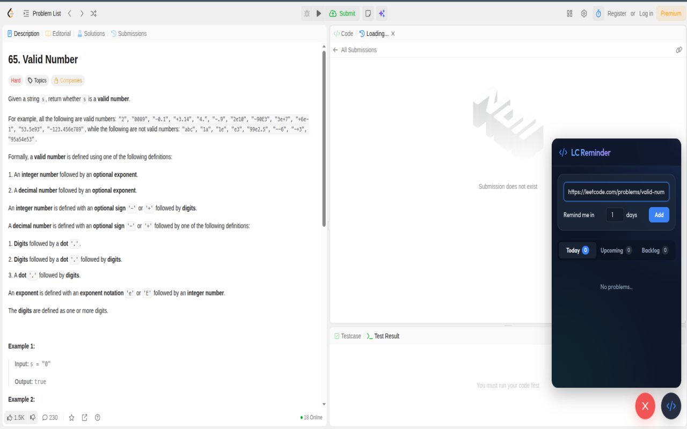

# LeetCode Problem Reminder

A Chrome extension designed to help you schedule, track, and manage your LeetCode problem practice. It allows you to schedule problems to reappear after a set number of days and provides a seamless UI for monitoring your tasks directly on LeetCode.com, as well as via a convenient popup interface.

## Features

- **Schedule Reminders**: Easily set a reminder for a LeetCode problem to revisit it after a specified number of days (e.g., 1 day, 3 days, 1 week).
- **Auto-fill URL**: When on a LeetCode, GeeksforGeeks, or NeetCode problem page, the extension automatically populates the problem URL in the reminder form.
- **Task Management**: View your problems organized into Today, Upcoming, and Backlog categories.
- **Export Data**: Easily export your entire problem reminder history to a CSV file (Excel-compatible) with a single click.
- **On-Page Widget**: Access your reminders directly on LeetCode via an integrated, floating widget.
- **Extension Popup**: Use the popup interface from any webpage to quickly manage your reminders.

## Screenshot

## Installation

### From Chrome Web Store
The easiest way to install the extension is directly from the [Chrome Web Store](https://chromewebstore.google.com/detail/gfodgdebhllgabeegdfoaoeidjnghdpp/).

### Manual Installation (Developer Mode)
1. Clone or download this repository.
2. Open Chrome and navigate to `chrome://extensions/`.
3. Enable **Developer mode** in the top right corner.
4. Click on **Load unpacked** and select the directory containing this extension.
5. Pin the extension to your toolbar for easy access!

## Usage

1. Navigate to a problem on [LeetCode](https://leetcode.com/problemset/all/).
2. Click the extension icon in your browser toolbar (or use the on-page floating widget).
3. The problem URL will be automatically filled. Add a name for the problem if you'd like.
4. Select when you want to be reminded (e.g., in 3 days).
5. Click **Add Task**.
6. Check your daily tasks from the extension popup or the on-page widget.
